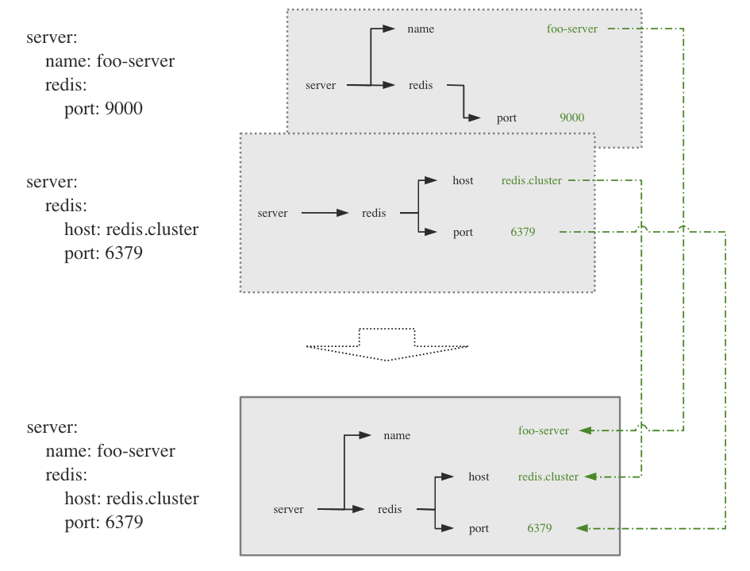

Overlay configuration
===================================

Overlay configuration is composition of multiple configure sources, each source is overlayed from bottom to top.
The top layer is visible if there is key conflicted among layers.



# Examples

See `examples/`. Build with `make all`, binaries are built in `bin/`.

## Load yaml files

Use `-of.f.y=...` to add yaml file.

```
./bin/simple -oc.f.y=./testdata/test1.yaml \
             -oc.f.y=./testdata/test2.yaml
```

> The left yaml file is more prior to right file, thus, if there are same keys in `test1.yaml` and `test2.yaml`, the value in `test1.yaml` will be got.

## Load from commandline arguments

Use commandline argument seperated by `.`.

```
./bin/simple -oc.f.y=./testdata/test1.yaml \
             -oc.f.y=./testdata/test2.yaml \
             -foo.id=999 \
             -foo.name=hello
```

> Commandline arguments is prior to yaml files, thus, `foo.id` will be got with value `999` which is from commandline argument.

## File required

## Silent mode

There are default verbose logs, silent mode can be turned on with `-oc.s`:

```
./bin/simple -oc.s \
             -oc.f.y=./testdata/test1.yaml \
             -oc.f.y=./testdata/test2.yaml
             -foo.id=999 \
             -foo.name=hello
```

# Usage

## Load

It's easy to initialize the default olayc with `Load()`.

```go
olayc.Load()
```

It's very common there are configure files must be loaded before program startup. 
Use `WithFileRequire()` on `Load()`, program will terminates if the required file is not loaded.

```
olayc.Load(
    olayc.WithFileRequire("test1.yaml"),
)
```

## Get scalar value

```go
olayc.Load()
id := olayc.Int("foo.id", 99))
name: = olayc.String("foo.name", "foo")
url := olayc.String("foo.url", "http://www.default.com"))
```

## Unmarshal to struct

Unmarshal is using yaml field tags.

```go

var cfg struct {
	Foo struct {
		Id   int    `yaml:'id'`
		Name string `yaml: 'name'`
		Url  string `yaml: 'url'`
	} `yaml: 'foo'`
}

olayc.Load()
olayc.Unmarshal(olayc.Root, &cfg)
```

# Priority

The default olayc has default priority when multiple configure sources are loaded:

- Commandline arguments, left prior
- Environment variables
- Yaml/Json Files, left prior

> In fact, the source has more priority is placed on upper layer.

# Internal olayc flags

There are internal olayc flags which are prefix with '-oc.|--oc.', use `-oc.h` to see help message.

```
Usage of olayc:
  oc.help | oc.h
         Print this help message.
  oc.silent | oc.s
         Set silent mode, default is false.
  oc.file.yaml | oc.f.y
         Load yaml file.
  oc.file.json | oc.f.j
         Load json file.
```

# Tests

Make sure run tests with `make test` if you fork this repo and try to add some features.
